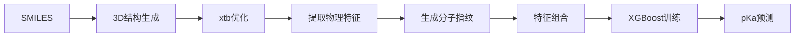

# pKa预测器 - Physics-Informed Machine Learning

基于物理信息的机器学习pKa预测系统，结合量子化学计算与XGBoost模型。

## 🌟 项目特点

- ✅ **物理约束**: 集成xtb量子化学计算，提取9个物理特征
- ✅ **混合特征**: 结合分子指纹与量子化学描述符
- ✅ **高效并行**: 支持多进程并行计算
- ✅ **断点续传**: 自动保存进度，支持中断恢复
- ✅ **数据采集**: 内置PubChem数据采集工具

## 📁 项目结构

```
Predict_pka/
├── main.py                 # 主程序入口
├── environment.yml         # Conda环境配置
├── src/                    # 核心模块
│   ├── preprocessor.py     # SMILES → 3D结构转换
│   ├── physics_engine.py   # xtb量子化学计算
│   ├── model_trainer.py    # XGBoost模型训练
│   └── utils.py           # 工具函数
├── tools/                  # 数据采集工具
│   ├── pubchem_scraper.py # PubChem爬虫
│   ├── config.yaml        # 爬虫配置
│   ├── quick_start.py     # 快速测试
│   └── README.md          # 工具文档
├── data/
│   ├── raw/               # 原始数据
│   ├── interim/           # 中间文件（3D结构）
│   └── processed/         # 处理后的特征
└── models/                # 训练好的模型

```

## 🚀 快速开始

### 1. 环境配置

```bash
# 创建conda环境
conda env create -f environment.yml
conda activate pka_predictor
```

### 2. 数据采集（可选）

如果需要从PubChem采集新数据：

```bash
# 快速测试（采集20个化合物）
python tools/quick_start.py

# 完整采集（采集5000个化合物，约3小时）
python tools/pubchem_scraper.py

# 自定义数量
python tools/pubchem_scraper.py --target 1000
```

详细说明请查看 [tools/README.md](tools/README.md)

### 3. 模型训练

```bash
# 使用默认数据训练
python main.py

# 使用采集的数据训练
python main.py --data data/raw/pubchem_compounds.csv --n_jobs 4

# 完整参数示例
python main.py \
  --data data/raw/data.csv \
  --n_jobs 8 \
  --chunk_size 50 \
  --model_path models/pka_model_v2.joblib
```

### 4. pKa预测

准备不含pKa列的CSV文件，然后：

```bash
python main.py --data new_compounds.csv --model_path models/pka_model_v1.joblib
```

预测结果将保存至 `new_compounds_predictions.csv`

## 📊 输入数据格式

### 训练数据（需包含pKa）

```csv
id,smiles,pka,initial_charge,uhf
mol1,CC(=O)O,4.76,0,0
mol2,c1ccccc1O,9.95,0,0
```

### 预测数据（无需pKa）

```csv
id,smiles,initial_charge,uhf
new1,CCO,0,0
new2,c1cccnc1,0,0
```

**字段说明：**
- `id`: 化合物唯一标识
- `smiles`: SMILES字符串
- `pka`: pKa值（训练时必需）
- `initial_charge`: 初始电荷（默认0）
- `uhf`: 未配对电子数（默认0）

## ⚙️ 主要参数

| 参数 | 说明 | 默认值 |
|------|------|--------|
| `--data` | 输入CSV文件路径 | data/raw/data.csv |
| `--n_jobs` | 并行进程数 | CPU核心数-1 |
| `--output_dir` | 3D结构保存目录 | data/interim/structures |
| `--xtb_dir` | xtb临时计算目录 | temp |
| `--processed_file` | 特征文件保存路径 | data/processed/features.csv |
| `--model_path` | 模型保存/加载路径 | models/pka_model_v1.joblib |
| `--chunk_size` | 断点保存频率 | 50 |

## 🔬 物理特征

项目提取的9个量子化学特征：

| 特征 | 含义 | 化学意义 |
|------|------|----------|
| total_energy | 总能量 | 分子稳定性 |
| homo | HOMO能级 | 给电子能力 |
| lumo | LUMO能级 | 受电子能力 |
| fermi_level | 费米能级 | 电子化学势 |
| gap | HOMO-LUMO能隙 | 化学稳定性 |
| max_pos_charge | 最大正电荷 | 电荷分布 |
| min_neg_charge | 最小负电荷 | 电荷分布 |
| max_h_charge | 氢原子最大电荷 | 酸性位点强度 |
| gsolv | 溶剂化自由能 | 溶解性 |

## 🔄 工作流程



详细流程：
1. **预处理**: SMILES → RDKit → 3D构象 → MMFF优化
2. **物理计算**: xtb几何优化 + 溶剂化模型（ALPB水）
3. **特征提取**: Morgan指纹（2048位）+ 物理特征（9个）
4. **模型训练**: 5折交叉验证 + XGBoost回归

## 📈 性能优化

### 计算时间估算

| 化合物数量 | 单核耗时 | 8核耗时 |
|-----------|---------|---------|
| 100 | ~2小时 | ~20分钟 |
| 1000 | ~20小时 | ~3小时 |
| 5000 | ~100小时 | ~15小时 |

### 优化建议

1. **调整并行数**: 根据CPU核心数设置 `--n_jobs`
2. **增加内存**: xtb计算需要足够内存（建议16GB+）
3. **使用SSD**: 大量IO操作，SSD可显著提速
4. **分批处理**: 大数据集分批训练，避免内存溢出

## 🐛 故障排查

### 问题1: xtb未找到
```
xtb executable not found
```
**解决**: 确认conda环境已激活，xtb已正确安装
```bash
conda activate pka_predictor
which xtb  # Linux/Mac
where.exe xtb  # Windows
```

### 问题2: 优化不收敛
```
GEOMETRY OPTIMIZATION NOT CONVERGED
```
**解决**: 
- 检查输入结构质量
- 调整xtb参数（增加迭代次数）
- 对于困难分子，手动调整初始结构

### 问题3: 内存不足
```
MemoryError
```
**解决**:
- 减少 `--n_jobs` 参数
- 降低 `--chunk_size`
- 分批处理数据

### 问题4: SMILES解析失败
```
Invalid SMILES
```
**解决**:
- 使用标准SMILES格式
- 检查特殊字符
- 使用RDKit标准化SMILES

## 📚 依赖说明

核心依赖（已在environment.yml中配置）：

- **化学计算**: rdkit, xtb, xtb-python
- **机器学习**: scikit-learn, xgboost
- **数据处理**: pandas, numpy
- **网络请求**: requests, pyyaml（数据采集）
- **工具**: tqdm（进度条）

## 🔐 注意事项

1. **计算资源**: xtb计算消耗CPU，建议服务器运行
2. **数据质量**: 确保输入SMILES有效，pKa值准确
3. **许可证**: 遵守PubChem和相关数据库使用条款
4. **学术用途**: 本项目仅供学术研究使用

## 📖 参考文献

- **xtb**: Grimme, S. et al. J. Chem. Theory Comput. 2019
- **ALPB**: Klamt, A. J. Phys. Chem. 1995
- **XGBoost**: Chen, T. & Guestrin, C. KDD 2016
- **RDKit**: https://www.rdkit.org

## 🤝 贡献

欢迎提交Issue和Pull Request改进项目！

## 📄 许可

本项目仅供学术研究使用。

---

**作者**: pKa预测项目组  
**更新日期**: 2026年2月9日  
**版本**: 1.0.0
